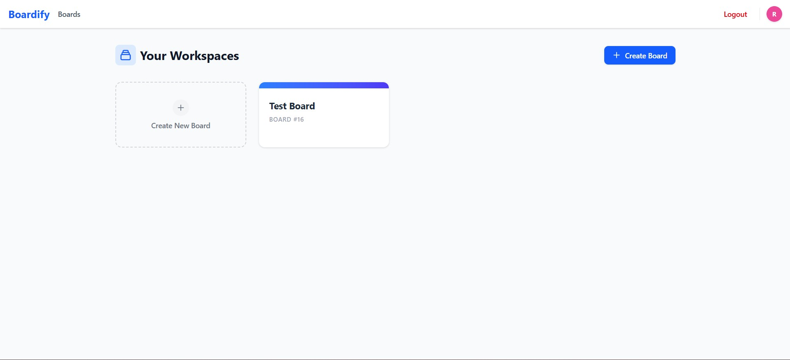

# Boardify - Frontend

Boardify is a modern, full-stack task management application inspired by Trello. This repository contains the **Frontend** code, built with React, TypeScript, and Tailwind CSS. It features a responsive Kanban board interface, drag-and-drop task management, and secure authentication.



## ✨ Features

- **🔐 Authentication:** Secure Login & Registration with JWT & HttpOnly Cookies.
- **📂 Board Management:** Create, rename, and delete workspaces.
- **📝 Kanban Boards:** Drag-and-drop lists and tasks (using `@hello-pangea/dnd`).
- **⚡ Real-time Updates:** State management via Redux Toolkit for instant UI feedback.
- **💬 Collaboration:** Add comments to tasks and invite members by email.
- **🎨 Modern UI:** Fully responsive design built with Tailwind CSS.
- **🔔 Notifications:** Toast notifications for success and error feedback.
- **👤 User Profiles:** Avatar generation and profile management.

## 🛠️ Tech Stack

- **Framework:** [React](https://reactjs.org/) (via [Vite](https://vitejs.dev/))
- **Language:** [TypeScript](https://www.typescriptlang.org/)
- **State Management:** [Redux Toolkit](https://redux-toolkit.js.org/)
- **Styling:** [Tailwind CSS](https://tailwindcss.com/)
- **Drag & Drop:** [@hello-pangea/dnd](https://github.com/hello-pangea/dnd)
- **HTTP Client:** [Axios](https://axios-http.com/) (with Interceptors for auto-token refresh)
- **Icons:** [Heroicons](https://heroicons.com/)
- **Dates:** [date-fns](https://date-fns.org/)
- **Toasts:** [react-hot-toast](https://react-hot-toast.com/)

---

## Getting Started

# Boardify — Frontend

A responsive Kanban-style frontend for the Boardify app, built with React, TypeScript, Vite and Tailwind CSS. This repository contains the UI and client-side logic for boards, lists, tasks, comments, authentication and user profiles.


## ✨ Key Features

- Authentication (login/register) with secure tokens
- Create / rename / delete boards (workspaces)
- Kanban-style lists and tasks with drag-and-drop (`@hello-pangea/dnd`)
- Task details, comments, and member assignment
- Toast notifications for user feedback (`react-hot-toast`)
- State management with Redux Toolkit
- Responsive UI using Tailwind CSS

## 🛠️ Tech Stack

- React + Vite
- TypeScript
- Redux Toolkit
- Tailwind CSS
- Axios (API client)
- @hello-pangea/dnd (drag & drop)
- react-hot-toast (toasts)

---

## Quick Start

Prerequisites:

- Node.js v16+ and npm or yarn
- Boardify backend running (configure `VITE_API_BASE_URL`)

1. Clone the repo

```bash
git clone https://github.com/your-username/boardify-frontend.git
cd boardify-frontend
```

2. Install dependencies

```bash
npm install
# or
yarn
```

3. Add environment variables

Create a `.env` in the project root with the API base URL:

```env
VITE_API_BASE_URL=http://localhost:8080
```

4. Run the dev server

```bash
npm run dev
# or
yarn dev
```

Open http://localhost:5173 in your browser.

## Available Scripts

- `npm run dev` — start development server
- `npm run build` — build production assets into `dist/`
- `npm run preview` — preview production build locally
- `npm run lint` — run ESLint checks

---

## Project Structure

```
src/
├── api/           # Axios client & interceptors
├── app/           # Redux store, hooks
├── components/    # Layout, UI primitives
├── features/      # Feature modules (auth, boards, lists, tasks, comments)
└── main.tsx       # App entry & routing
```

---

## Deployment

Build with:

```bash
npm run build
```

Then deploy the contents of `dist/` to your hosting provider (Vercel, Netlify, Render, etc.). Ensure `VITE_API_BASE_URL` points to your production backend.

---

## Contributing

1. Fork the repository
2. Create a branch: `git checkout -b feature/your-feature`
3. Make changes, run tests/linting
4. Commit and push
5. Open a pull request

Please follow the existing code style and run the linter before opening a PR.

---
